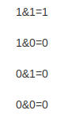

## [201. 数字范围按位与](https://leetcode-cn.com/problems/bitwise-and-of-numbers-range/)

## 题目

给定范围 [m, n]，其中 0 <= m <= n <= 2147483647，返回此范围内所有数字的按位与（包含 m, n 两端点）。

```java
示例 1: 

输入: [5,7]
输出: 4
```

```java
示例 2:

输入: [0,1]
输出: 0
```


链接：https://leetcode-cn.com/problems/bitwise-and-of-numbers-range

## 解题记录

+ 先了解一个按位与，二进制计算，运算符为`&`, 就是两个同位，都为1的时候为1否则为0



+ 因此这里可以的出一个结论，0和任何数与都是0,于是有了如下的代码：

```java
/**
 * @author: ffzs
 * @Date: 2020/8/23 上午10:04
 */

public class Solution {
    public int rangeBitwiseAnd(int m, int n) {
        for (int i = m+1; i <= n&& i>=0; i++) {
            if (m == 0) return 0;
            m &= i;
        }
        return m;
    }
}

class Test {
    public static void main(String[] args) {
        Solution solution = new Solution();
        System.out.println(solution.rangeBitwiseAnd(2147483646, 2147483647));
    }
}
```


结果速度出奇的慢，看来二进制的题目还要使用二进制的方法来解决

+ 由于题目过程是一个累与的过程，只要在计算的过程中某一位出现了0,那没返回中改为就一定是0
+ 由于是按位，一个位数多的数会迁就位数少的数，与之后多出的部分就不记了
+ 我们来看一下两个位数相同数与中的一些规律
  + `101`&`111`=`101`, `110`&`101`=`100`  大数和小数进行与操作会变小
  + 可见这个过程无外乎三种结果：0, m，末位之后全是0,`110000`,这三种情况都是小于等于m的
+ 其实上面方法的逻辑也没啥问题，如果n一直向下&n-1的话，那么中间可以跳过很多没有必要的&运算，而m向上就没有这种便利，因为&运算总是让值变小

```java
/**
 * @author: ffzs
 * @Date: 2020/8/23 上午10:45
 */
public class Solution2 {
    public int rangeBitwiseAnd(int m, int n) {
        while (m < n) {
            n &= n-1;
        }
        return n;
    }
}
```

