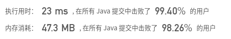

## [546. 移除盒子](https://leetcode-cn.com/problems/remove-boxes/)

## 题目

给出一些不同颜色的盒子，盒子的颜色由数字表示，即不同的数字表示不同的颜色。
你将经过若干轮操作去去掉盒子，直到所有的盒子都去掉为止。每一轮你可以移除具有相同颜色的连续 k 个盒子（k >= 1），这样一轮之后你将得到 k*k 个积分。
当你将所有盒子都去掉之后，求你能获得的最大积分和。

 

```java
示例：

输入：boxes = [1,3,2,2,2,3,4,3,1]
输出：23
解释：
[1, 3, 2, 2, 2, 3, 4, 3, 1] 
----> [1, 3, 3, 4, 3, 1] (3*3=9 分) 
----> [1, 3, 3, 3, 1] (1*1=1 分) 
----> [1, 1] (3*3=9 分) 
----> [] (2*2=4 分)
```

```java
提示：

1 <= boxes.length <= 100
1 <= boxes[i] <= 100
```


链接：https://leetcode-cn.com/problems/remove-boxes

## 解题记录

+ 由于得分是个数的平方，那么凑的个数越多越有优势，5个和4个的差距有9分之多
+ 如果一种颜色只有一个，那么他无论何时处理都能只积累1分，我们选择优先处理这种只有1个的，会减少之后处理的复杂程度
+ 对于求最优使用动态规划，使用官方题解的方法，有个图解思路很清晰可以参考：https://leetcode-cn.com/problems/remove-boxes/solution/guan-fang-fang-fa-2ji-yi-hua-sou-suo-dong-hua-tu-j/

```java
/**
 * @author: ffzs
 * @Date: 2020/8/15 上午10:33
 */
public class Solution {

    int[][][] dp;
    int[] boxes;
    public int removeBoxes(int[] boxes) {
        int[] valueCount = new int[101];
        for (int box : boxes) valueCount[box]++;
        int[] tmp = new int[boxes.length];
        int idx = 0;
        for (int box : boxes) {
            if (valueCount[box] > 1) {
                tmp[idx] = box;
                idx++;
            }
        }
        this.boxes = Arrays.copyOf(tmp, idx);
        dp = new int[idx][idx][idx];
        return dfs(0, this.boxes.length-1, 0) + tmp.length-idx;
    }

    private int dfs (int l, int r, int k) {
        if (l > r) return 0;
        if (dp[l][r][k] != 0) return dp[l][r][k];
        while (r > l && boxes[r] == boxes[r-1]) {
            r --;  k ++;
        }
        dp[l][r][k] = dfs(l, r-1, 0) + (k + 1) * (k + 1);

        for (int i = l; i< r; ++i){
            if (boxes[i] == boxes[r]) {
                dp[l][r][k] = Math.max(dp[l][r][k], dfs(l, i, k+1)+dfs(i+1, r-1, 0));
            }
        }
        return dp[l][r][k];
    }
}

class Test {
    public static void main(String[] args) {
        Solution solution = new Solution();
        int[] boxes = {1,3,2,2,2,3,4,3,1};
        System.out.println(solution.removeBoxes(boxes));
    }
}
```



+ 总觉得可以根据积分预期来解决，以后再填坑吧