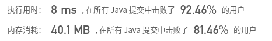

## [459. 重复的子字符串](https://leetcode-cn.com/problems/repeated-substring-pattern/)

## 题目

给定一个非空的字符串，判断它是否可以由它的一个子串重复多次构成。给定的字符串只含有小写英文字母，并且长度不超过10000。

```java
示例 1:

输入: "abab"

输出: True

解释: 可由子字符串 "ab" 重复两次构成。
```

```java
示例 2:

输入: "aba"

输出: False
```

```java
示例 3:

输入: "abcabcabcabc"

输出: True

解释: 可由子字符串 "abc" 重复四次构成。 (或者子字符串 "abcabc" 重复两次构成。)
```


链接：https://leetcode-cn.com/problems/repeated-substring-pattern

## 解题记录

+ 重头开始截取一段长度，首先计算能否整除，不能整除不成立
+ 之后比对每一个循环是否跟截取相同，不同的话直接返回false

```java
/**
 * @author: ffzs
 * @Date: 2020/8/24 上午8:35
 */
public class Solution {
    public boolean repeatedSubstringPattern(String s) {
        int len = s.length();
        char[] seq = s.toCharArray();
        for (int i = 0; i < len/2; i++) {
            if (isRepeat(seq, i)) return true;
        }
        return false;
    }

    private boolean isRepeat (char[] seq, int end) {
        if (seq.length % ( end+1 ) != 0) return false;
        int times = seq.length / ( end+1 );
        if (times == 1) return false;
        for (int i = 0; i <= end; i++) {
            for (int j = 1; j < times; j++) {
                if (seq[i] != seq[j*(end+1)+i]) return false;
            }
        }
        return true;
    }
}
```

