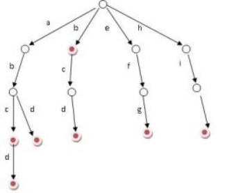

## [面试题 17.13. 恢复空格](https://leetcode-cn.com/problems/re-space-lcci/)

## 题目

哦，不！你不小心把一个长篇文章中的空格、标点都删掉了，并且大写也弄成了小写。像句子"I reset the computer. It still didn’t boot!"已经变成了"iresetthecomputeritstilldidntboot"。在处理标点符号和大小写之前，你得先把它断成词语。当然了，你有一本厚厚的词典dictionary，不过，有些词没在词典里。假设文章用sentence表示，设计一个算法，把文章断开，要求未识别的字符最少，返回未识别的字符数。

注意：本题相对原题稍作改动，只需返回未识别的字符数

 

```java
示例：

输入：
dictionary = ["looked","just","like","her","brother"]
sentence = "jesslookedjustliketimherbrother"
输出： 7
解释： 断句后为"jess looked just like tim her brother"，共7个未识别字符。
```

```java
提示：

0 <= len(sentence) <= 1000
dictionary中总字符数不超过 150000。
你可以认为dictionary和sentence中只包含小写字母。
```


链接：https://leetcode-cn.com/problems/re-space-lcci

## 解题记录

+ 通过动态规划记录之前最小值情况
+ 如果i未匹配，那么`dp[i] = dp[i-1] +1`，累积加一
+ 因为是通过i-1获取，那么需要dp长度是要是length+1，初始为dp[0] = 0
+ 如果i大于等于字典中的最短长度，min的话就可以对i之前的字符与字典中进行比较，如果j～i能够匹配，说明这部分是匹配的, 未匹配没有增加，`dp[i] = dp[j]`
+ 由于一个末位可以匹配上多个字典中内容，因此需要`Math.min(dp[i], dp[j])`获取最小值

```java
/**
 * @author ffzs
 * @describe
 * @date 2020/7/9
 */
public class Solution {
    public int respace(String[] dictionary, String sentence) {
        int min = dictionary[0].length(), max = min;
        Set<String> wordSet = new HashSet<>();
        for (String s : dictionary) {
            if (s.length() < min) min = s.length();
            else if (s.length() > max) max = s.length();
            wordSet.add(s);
        }

        int[] dp = new int[sentence.length()+1];
        for (int i = 1; i < sentence.length()+1; i++) {
            dp[i] = dp[i-1] + 1;
            if (i - min >= 0) {
                for (int j = Math.max(i-max, 0); j <= i-min; j++) {
                    if (wordSet.contains(sentence.substring(j, i))) dp[i] = Math.min(dp[i], dp[j]);
                }
            }
        }
        return dp[sentence.length()];
    }
}

```


## 字典树/Trie树/前缀树



又称单词查找树，[Trie树](https://baike.baidu.com/item/Trie树)，是一种[树形结构](https://baike.baidu.com/item/树形结构/9663807)，是一种哈希树的变种。典型应用是用于统计，排序和保存大量的[字符](https://baike.baidu.com/item/字符)串（但不仅限于字符串），所以经常被搜索引擎系统用于文本词频统计。它的优点是：利用字符串的公共前缀来减少查询时间，最大限度地减少无谓的字符串比较，查询效率比哈希树高。

+ 通过构建前缀树对字典进行处理
+ 在树节点中标记是否为单词的终止字符
+ 动态规划逻辑同上面解法

```java
/**
 * @author ffzs
 * @describe
 * @date 2020/7/9
 */

class TrieNode {
    boolean isEnd = false;
    TrieNode[] children = new TrieNode[26];

    public TrieNode() {}
}

class Trie {
    public TrieNode root = new TrieNode();

    public Trie () {}

    public void insert(String word){
        TrieNode cur = root;
        for (int i = word.length()-1; i >=0 ; --i) {
            int c = word.charAt(i) - 'a';
            if (cur.children[c] == null) {
                cur.children[c] = new TrieNode();
            }
            cur = cur.children[c];
        }
        cur.isEnd = true;
    }
}


public class Solution2 {
    public static int respace(String[] dictionary, String sentence) {
        int len = sentence.length();
        Trie trie = new Trie();
        for (String s : dictionary) trie.insert(s);

        int[] dp = new int[len + 1];
        for (int i = 1; i < len + 1; ++i) {
            dp[i] = dp[i-1] + 1;
            TrieNode cur = trie.root;
            for (int j = i; j >= 1; --j) {
                int c = sentence.charAt(j-1) - 'a';
                if (cur.children[c] == null) break;
                cur = cur.children[c];
                if (cur.isEnd){
                    dp[i] = Math.min(dp[i], dp[j-1]);
                    if (dp[i] == 0) break;
                }
            }
        }
        return dp[len];
    }

    public static void main(String[] args) {
        String[] dictionary = {"potimzz"};
        String sentence = "potimzzpotimzz";

        System.out.println(respace(dictionary, sentence));
    }
}

```

