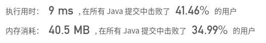

## [557. 反转字符串中的单词 III](https://leetcode-cn.com/problems/reverse-words-in-a-string-iii/)

## 题目

给定一个字符串，你需要反转字符串中每个单词的字符顺序，同时仍保留空格和单词的初始顺序。

 

```java
示例：

输入："Let's take LeetCode contest"
输出："s'teL ekat edoCteeL tsetnoc"
```

```java
提示：

在字符串中，每个单词由单个空格分隔，并且字符串中不会有任何额外的空格。
```


链接：https://leetcode-cn.com/problems/reverse-words-in-a-string-iii

## 解题记录

+ 遇到空格将之前的字符串倒转即可
+ StringBuilder版本

```java
/**
 * @author: ffzs
 * @Date: 2020/8/30 上午7:32
 */

public class Solution {
    public String reverseWords(String s) {
        char[] seq = s.toCharArray();
        StringBuilder res = new StringBuilder();
        StringBuilder tmp = new StringBuilder();
        for (char c : seq) {
            if (c == ' ') {
                res.append(tmp.reverse()).append(' ');
                tmp = new StringBuilder();
            }
            else tmp.append(c);
        }
        return res.append(tmp.reverse()).toString();
    }
}
```



+ 使用原列表，自己写换位

```java
/**
 * @author: ffzs
 * @Date: 2020/8/30 上午7:38
 */
public class Solution2 {
    char[] seq;
    int pre = 0;
    public String reverseWords(String s) {
        this.seq = s.toCharArray();
        for (int i = 0; i < seq.length; i++) {
            if (seq[i] == ' ') {
                reverse(pre, i-1);
                pre = i+1;
            }
        }
        reverse(pre, seq.length-1);
        return new String(seq);
    }
    private void reverse (int l, int r) {
        while (l<r){
            char tmp = seq[l];
            seq[l++] = seq[r];
            seq[r--] = tmp;
        }
    }
}
```


## python一行解题

```python
class Solution:
    def reverseWords(self, s: str) -> str:
        return ' '.join([item[::-1] for item in s.split(' '))
```

​	


## Java一行解题

```java
/**
 * @author: ffzs
 * @Date: 2020/8/30 上午7:57
 */
public class Solution3 {
    public String reverseWords(String s) {
        return Stream.of(s.split(" ")).map(it->new StringBuilder(it).reverse().toString()).reduce((v1, v2)-> v1+" "+ v2).get();
    }
}
```

