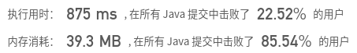
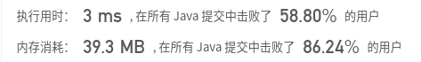
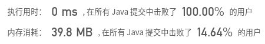

## [337. 打家劫舍 III](https://leetcode-cn.com/problems/house-robber-iii/)

## 题目

在上次打劫完一条街道之后和一圈房屋后，小偷又发现了一个新的可行窃的地区。这个地区只有一个入口，我们称之为“根”。 除了“根”之外，每栋房子有且只有一个“父“房子与之相连。一番侦察之后，聪明的小偷意识到“这个地方的所有房屋的排列类似于一棵二叉树”。 如果两个直接相连的房子在同一天晚上被打劫，房屋将自动报警。

计算在不触动警报的情况下，小偷一晚能够盗取的最高金额。

```
示例 1:

输入: [3,2,3,null,3,null,1]

     3
    / \
   2   3
    \   \ 
     3   1

输出: 7 
解释: 小偷一晚能够盗取的最高金额 = 3 + 3 + 1 = 7.
```

```
示例 2:

输入: [3,4,5,1,3,null,1]

     3
    / \
   4   5
  / \   \ 
 1   3   1

输出: 9
解释: 小偷一晚能够盗取的最高金额 = 4 + 5 = 9.
```


链接：https://leetcode-cn.com/problems/house-robber-iii

## 解题记录

+ 同类题目 [Leetcode:NO.198 打家劫舍 动态规划](https://blog.csdn.net/tonydz0523/article/details/106418403)
+ 最优状态可以是父+孙和子的中最大的

```java
/**
 * @author: ffzs
 * @Date: 2020/8/5 上午7:10
 */

class TreeNode {
    int val;
    TreeNode left;
    TreeNode right;
    TreeNode(int x) { val = x; }
}

public class Solution {
    public int rob(TreeNode root) {
        if (root == null) return 0;


        int left = 0, right = 0;
        if (root.left != null) left = rob(root.left.left) + rob(root.left.right);
        if (root.right != null) right = rob(root.right.left) + rob(root.right.right);

        return Math.max(root.val+left+right, rob(root.left) + rob(root.right));
    }
}

```



耗时较长，效果不理想

### 进阶

+ 通过使用map对每一个出现过的root对应的最优值进行记录，再次访问的时候直接返回对应值

```java
/**
 * @author: ffzs
 * @Date: 2020/8/5 上午7:58
 */
public class Solution2 {
    HashMap<TreeNode, Integer> map = new HashMap<>();
    public int rob(TreeNode root) {
        if (root == null) return 0;
        if (map.containsKey(root)) return map.get(root);
        int left = 0, right = 0;
        if (root.left != null) left = rob(root.left.left) + rob(root.left.right);
        if (root.right != null) right = rob(root.right.left) + rob(root.right.right);
        int ret = Math.max(root.val+left+right, rob(root.left) + rob(root.right));
        map.put(root, ret);
        return ret;
    }
}
```



### 再进阶

+ 通过后序遍历递归树， 优先处理子节点
+ 通过直接在树上做修改记录子节点的最优情况
+ 最后汇总到root

```java
/**
 * @author: ffzs
 * @Date: 2020/8/5 上午8:15
 */
public class Solution3 {

    public int rob(TreeNode root) {
        if (root == null) return 0;
        subRob(root);
        return root.val;
    }

    private void subRob (TreeNode root) {
        if (root.left!= null) subRob(root.left);
        if (root.right!= null) subRob(root.right);

        int s1 = 0, s2 = root.val;

        if(root.left!=null) {
            s1 += root.left.val;
            s2 += root.left.left != null ? root.left.left.val:0;
            s2 += root.left.right != null ? root.left.right.val:0;
        }


        if (root.right != null) {
            s1 += root.right.val;
            s2 += root.right.left != null ? root.right.left.val:0;
            s2 += root.right.right != null ? root.right.right.val:0;
        }

        root.val = Math.max(s1, s2);
    }
}
```

