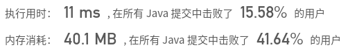
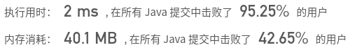

## [51. N 皇后](https://leetcode-cn.com/problems/n-queens/)

## 题目

*n* 皇后问题研究的是如何将 *n* 个皇后放置在 *n*×*n* 的棋盘上，并且使皇后彼此之间不能相互攻击。

给定一个整数 n，返回所有不同的 n 皇后问题的解决方案。

每一种解法包含一个明确的 n 皇后问题的棋子放置方案，该方案中 'Q' 和 '.' 分别代表了皇后和空位。

 

```java
示例：

输入：4
输出：[
 [".Q..",  // 解法 1
  "...Q",
  "Q...",
  "..Q."],

 ["..Q.",  // 解法 2
  "Q...",
  "...Q",
  ".Q.."]
]
解释: 4 皇后问题存在两个不同的解法。

```

```java
提示：

皇后彼此不能相互攻击，也就是说：任何两个皇后都不能处于同一条横行、纵行或斜线上。
```


链接：https://leetcode-cn.com/problems/n-queens

## 解题记录

+ 通过使用回溯算法求解
+ 通过一个二维数组进行记录
+ 如果不可行返回上一步
+ 如果可行将二维数组转化为要求格式，并加入返回数组

```java
/**
 * @author: ffzs
 * @Date: 2020/9/3 上午7:39
 */
public class Solution {

    int[][] step;
    List<List<String>> res = new ArrayList<>();
    int[] count;
    int n;

    public List<List<String>> solveNQueens(int n) {
        this.n = n;
        this.step = new int[n][n];
        this.count = new int[n];
        dfs(0);
        return res;
    }

    private void dfs (int r) {
        if (r==n){
            res.add(transTable());
            return;
        }
        for (int i = 0; i < n; i++) {
            // 保存状态
            if (step[r][i]==0) {
                int[][] tmp = deepCopy(step);
                int[] tmpCount = Arrays.copyOf(count, n);
                if (fillArray(r, i)) {
                    dfs(r+1);
                }
                step = tmp;
                count = tmpCount;
            }
        }
    }

    private boolean fillArray (int r, int i) {
        for (int j = r; j < n; j++) {
            if (j==r) {
                Arrays.fill(step[r], 1);
                step[r][i] = -1;
                count[r] = n;
            }else{
                for (int k = 0; k < n; k++) {
                    if ((k==i || k==i-(j-r) || k==i+(j-r))&&step[j][k]==0) {
                        step[j][k] = 1;
                        if (count[j] <= n) count[j]++;
                        else return false;
                    }
                }
            }
        }
        return true;
    }

    private List<String> transTable () {
        List<String> ret = new ArrayList<>();
        for (int[] ints : step) {
            StringBuilder s = new StringBuilder();
            for (int j = 0; j < step.length; j++) {
                if (ints[j] == -1) s.append('Q');
                else if (ints[j] == 1) s.append('.');
            }
            ret.add(s.toString());
        }
        return ret;
    }

    private int[][] deepCopy (int[][] reference) {
        int[][] copy = new int[reference.length][reference.length];
        for (int i = 0; i < reference.length; i++) {
            System.arraycopy(reference[i], 0, copy[i], 0, reference.length);
        }
        return copy;
    }
}

class Test {
    public static void main(String[] args) {
        int row = 5;
        Solution solution = new Solution();
        System.out.println(solution.solveNQueens(row));
    }
}
```



## 进阶

+ 不用填满数组，通过记录行以及斜线的方法来判断哪个位置可以放Q
+ 行坐标和列坐标的差值相同为在同一右下方向斜线
+ 行列坐标相加之和相同说明在同一左下方向斜线
+ 这样回溯更方便，不用来回copy表


```java
/**
 * @author: ffzs
 * @Date: 2020/9/3 上午9:12
 */
public class Solution2 {
    char[][] step;
    List<List<String>> res = new ArrayList<>();
    boolean[] column, rightDown, leftDown;
    int n;

    public List<List<String>> solveNQueens(int n) {
        this.n = n;
        this.step = new char[n][n];
        this.column = new boolean[n];
        this.rightDown = new boolean[n*2-1];
        this.leftDown = new boolean[n*2-1];
        dfs(0);
        return res;
    }

    private void dfs (int r) {
        if (r==n){
            res.add(transTable());
            return;
        }
        Arrays.fill(step[r], '.');
        for (int i = 0; i < n; i++) {
            int right = r-i+n-1;
            int left = r+i;
            if (!column[i] && !rightDown[right] && !leftDown[left]) {
                step[r][i] = 'Q';
                column[i] = rightDown[right] = leftDown[left] = true;
                dfs(r+1);
                // 回溯
                step[r][i] = '.';
                column[i] = rightDown[right] = leftDown[left] = false;
            }
        }
    }

    private List<String> transTable () {
        List<String> ret = new ArrayList<>();
        for (char[] ints : step) {
            ret.add(new String(ints));
        }
        return ret;
    }
}
```



