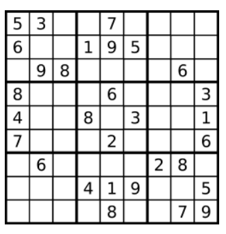
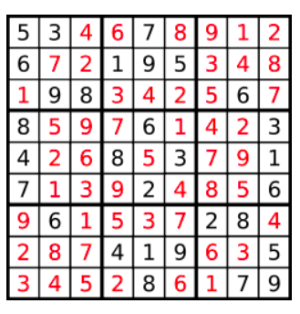
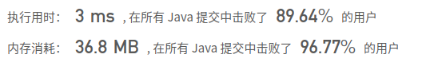

## [37. 解数独](https://leetcode-cn.com/problems/sudoku-solver/)

## 题目

编写一个程序，通过已填充的空格来解决数独问题。

一个数独的解法需遵循如下规则：

数字 1-9 在每一行只能出现一次。
数字 1-9 在每一列只能出现一次。
数字 1-9 在每一个以粗实线分隔的 3x3 宫内只能出现一次。
空白格用 '.' 表示。



一个数独。



答案被标成红色。

Note:

给定的数独序列只包含数字 1-9 和字符 '.' 。
你可以假设给定的数独只有唯一解。
给定数独永远是 9x9 形式的。

链接：https://leetcode-cn.com/problems/sudoku-solver

## 解题记录

+ 通过三个数组存储每行每列以及每一个3*3矩阵的数字出现情况
+ 首先遍历整个表，将空白统计到一个list中，将已经出现过的情况统计到 三个数组中
+ 每一轮从list中取处指定空白区进行填数，1-9个数依次尝试
+ 并进行回溯，直到list中所有位置都被填满，结束

```java
/**
 * @author: ffzs
 * @Date: 2020/9/15 上午6:19
 */
public class Solution {

    boolean[][] row = new boolean[9][9];
    boolean[][] col = new boolean[9][9];
    boolean[][][] matrix = new boolean[3][3][9];
    List<int[]> blankList = new ArrayList<>();
    boolean ok = false;
    char[][] board;
    public void solveSudoku(char[][] board) {
        this.board = board;
        for (int i = 0; i < board.length; i++) {
            for (int j = 0; j < board[0].length; j++) {
                char cur = board[i][j];
                if (cur=='.') {
                    blankList.add(new int[]{i,j});
                }
                else {
                    row[i][cur-'1'] = true;
                    col[j][cur-'1'] = true;
                    matrix[i/3][j/3][cur-'1'] = true;
                }
            }
        }
        dfs(0);
    }

    private void dfs (int index) {
        if (!ok) {
            if (index == blankList.size()) {
                ok = true;
                return;
            }
            int[] cur = blankList.get(index);
            int i = cur[0];
            int j = cur[1];
            for (int k = 0; k < 9; k++) {
                if (!row[i][k] && !col[j][k] && !matrix[i/3][j/3][k]) {
                    row[i][k] = col[j][k] = matrix[i/3][j/3][k] = true;
                    board[i][j] = (char)(k + '1');
                    dfs(index+1);
                    if (!ok) {
                        row[i][k] = col[j][k] = matrix[i/3][j/3][k] = false;
                    }
                }
            }
        }
    }
}
```

