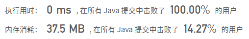

## [75. 颜色分类](https://leetcode-cn.com/problems/sort-colors/)

## 题目

给定一个包含红色、白色和蓝色，一共 n 个元素的数组，原地对它们进行排序，使得相同颜色的元素相邻，并按照红色、白色、蓝色顺序排列。

此题中，我们使用整数 0、 1 和 2 分别表示红色、白色和蓝色。

注意:
不能使用代码库中的排序函数来解决这道题。

```java
示例:

输入: [2,0,2,1,1,0]
输出: [0,0,1,1,2,2]
```

```java
进阶：

一个直观的解决方案是使用计数排序的两趟扫描算法。
首先，迭代计算出0、1 和 2 元素的个数，然后按照0、1、2的排序，重写当前数组。
你能想出一个仅使用常数空间的一趟扫描算法吗？
```


链接：https://leetcode-cn.com/problems/sort-colors

## 解题记录

+ 使用计算排序，通过一个数组统计0,1,2出现的个数
+ 然后根据个数重新写入数组中

```java
/**
 * @author: ffzs
 * @Date: 2020/10/7 上午9:54
 */
public class Solution {

    public void sortColors(int[] nums) {
        int[] counter = new int[3];
        for (int num : nums) {
            counter[num] ++;
        }
        int idx = 0;
        for (int i = 0; i < counter.length; i++) {
            for (int j = 0; j < counter[i]; j++) {
                nums[idx++] = i;
            }
        }
    }
}
```


## 进阶

+ 通过三个指针进行位置交换，左指针跳过0,指向非0
+ 右边的指针跳过2
+ 通过mid指针对中间进行扫描，如果是2跟右指针换一下，换完之后右指针左移一个单位，因为换过来的可能是0,所以这时候中间指针不能右移
+ 如果是0的话和左指针换一下

```java
/**
 * @author: ffzs
 * @Date: 2020/10/7 上午10:05
 */
public class Solution2 {

    public void sortColors(int[] nums) {
        int left = 0, right = nums.length-1;
        while (left<nums.length-1 && nums[left] == 0) left++;
        while (right>=0 && nums[right] == 2) right--;
        int mid = left;

        while (mid <= right) {
            if (nums[mid] == 0) {
                swap(nums, left++, mid++);
            }
            else if (nums[mid] == 2) {
                swap(nums, right--, mid);
            }
            else mid ++;
        }
    }

    private void swap (int[] nums, int i, int j) {
        int tmp = nums[i];
        nums[i] = nums[j];
        nums[j] = tmp;
    }
}
```

