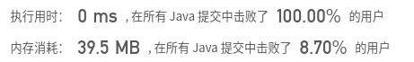

## [108. 将有序数组转换为二叉搜索树](https://leetcode-cn.com/problems/convert-sorted-array-to-binary-search-tree/)

## 题目

将一个按照升序排列的有序数组，转换为一棵高度平衡二叉搜索树。

本题中，一个高度平衡二叉树是指一个二叉树每个节点 的左右两个子树的高度差的绝对值不超过 1。

```
示例:

给定有序数组: [-10,-3,0,5,9],

一个可能的答案是：[0,-3,9,-10,null,5]，它可以表示下面这个高度平衡二叉搜索树：

      0
     / \

   -3   9
   /   /
 -10  5
```


链接：https://leetcode-cn.com/problems/convert-sorted-array-to-binary-search-tree

## 解题记录

+ 使用二分法 通过递归构建树

```java
/**
 * @author ffzs
 * @describe
 * @date 2020/7/3
 */

class TreeNode {
    int val;
    TreeNode left;
    TreeNode right;
    TreeNode(int x) { val = x; }
}

public class Solution {
    public TreeNode sortedArrayToBST(int[] nums) {
        return makeTree(nums,0, nums.length-1);
    }

    private TreeNode makeTree (int[] nums, int left, int right) {
        if (left == right) return new TreeNode(nums[left]);
        if (left > right) return null;

        int mid = left + right + 1 >> 1;

        TreeNode root = new TreeNode(nums[mid]);
        root.left = makeTree(nums, left, mid-1);
        root.right = makeTree(nums, mid+1, right);
        return root;
    }
}

```

