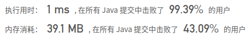

## [78. 子集](https://leetcode-cn.com/problems/subsets/)

## 题目

给定一组不含重复元素的整数数组 nums，返回该数组所有可能的子集（幂集）。

说明：解集不能包含重复的子集。

```java
示例:

输入: nums = [1,2,3]
输出:
[
  [3],
  [1],
  [2],
  [1,2,3],
  [1,3],
  [2,3],
  [1,2],
  []
]
```


链接：https://leetcode-cn.com/problems/subsets


## 解题记录

+ 使用回溯算法解题
+ 因为不能有重复子集，因此之前获取的值不能重复获取，这里通过控制start的位置，每一轮递增即可
+ 长度超出范围结速递归

```java
/**
 * @author: ffzs
 * @Date: 2020/9/20 上午7:06
 */
public class Solution {
    List<List<Integer>> res = new ArrayList<>();
    int[] nums;
    public List<List<Integer>> subsets(int[] nums) {
        this.nums = nums;
        dfs(new ArrayList<>(), 0);
        return res;
    }

    private void dfs (List<Integer> list, int start) {
        if (start > nums.length) {
            return;
        }
        res.add(new ArrayList<>(list));

        for (int i = start; i < nums.length; i++) {
            list.add(nums[i]);
            dfs(list, i+1);
            list.remove(list.size()-1);
        }
    }
}
```

