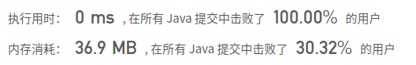

## [404. 左叶子之和](https://leetcode-cn.com/problems/sum-of-left-leaves/)

## 题目

计算给定二叉树的所有左叶子之和。

```
示例：

    3
   / \
  9  20
    /  \
   15   7
```

在这个二叉树中，有两个左叶子，分别是 9 和 15，所以返回 24


链接：https://leetcode-cn.com/problems/sum-of-left-leaves

## 解题记录

+ 注意题目问的是左子叶，父节点不算的，没有其他子节点的那种

```java
/**
 * @author: ffzs
 * @Date: 2020/9/19 上午7:05
 */

class TreeNode {
    int val;
    TreeNode left;
    TreeNode right;
    TreeNode(int x) { val = x; }
}

public class Solution {
    int res = 0;
    public int sumOfLeftLeaves(TreeNode root) {
        if (root == null) return 0;
        dfs(root, false);
        return res;
    }

    private void dfs (TreeNode root, boolean isLeft) {

        if (root.right == null && root.left == null && isLeft) {
            res += root.val;
        }

        if (root.left != null) dfs(root.left, true);
        if (root.right != null) dfs(root.right, false);
    }
}
```

