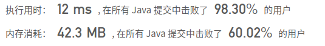
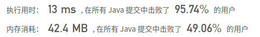

## [347. 前 K 个高频元素](https://leetcode-cn.com/problems/top-k-frequent-elements/)

## 题目

给定一个非空的整数数组，返回其中出现频率前 k 高的元素。

 

```java
示例 1:

输入: nums = [1,1,1,2,2,3], k = 2
输出: [1,2]
```

```java
示例 2:

输入: nums = [1], k = 1
输出: [1]
```

```java
提示：

你可以假设给定的 k 总是合理的，且 1 ≤ k ≤ 数组中不相同的元素的个数。
你的算法的时间复杂度必须优于 O(n log n) , n 是数组的大小。
题目数据保证答案唯一，换句话说，数组中前 k 个高频元素的集合是唯一的。
你可以按任意顺序返回答案。
```


链接：https://leetcode-cn.com/problems/top-k-frequent-elements

## 解题记录

+ 通过map进行数组中数值的统计
+ 取出value进行排序获取到第k个value的值
+ 通过比对值得到大于等于value值得key写入数组

```java
/**
 * @author: ffzs
 * @Date: 2020/9/7 上午7:08
 */
public class Solution {
    public int[] topKFrequent(int[] nums, int k) {
        Map<Integer, Integer> numMap = new HashMap<>();
        for (int num : nums) {
            numMap.compute(num, (key, value)-> value = value == null? 1: value +1);
        }
        List<Integer> values = new ArrayList<>(numMap.values());
        values.sort(Comparator.reverseOrder());
        int[] res = new int[k];
        System.out.println(values);
        int aim = values.get(k-1);
        int i = 0;
        for (Map.Entry<Integer, Integer> entry : numMap.entrySet()) {
            if (entry.getValue() >= aim) {
                System.out.println(entry.getValue());
                res[i] = entry.getKey();
                i++;
            }
        }
        return res;
    }
}

class Test {
    public static void main(String[] args) {
        Solution solution = new Solution();
        int[] nums = {4,1,-1,2,-1,2,3};
        System.out.println(Arrays.toString(solution.topKFrequent(nums, 2)));
    }
}
```



+ 通过对进行排序，始终维持堆的数量为k，如果新key的value大于当前最小，替换

```java
/**
 * @author: ffzs
 * @Date: 2020/9/7 上午8:07
 */
public class Solution2 {
    public int[] topKFrequent(int[] nums, int k) {
        Map<Integer, Integer> numMap = new HashMap<>();
        for (int num : nums) {
            numMap.compute(num, (key, value)-> value = value == null? 1: value +1);
        }
        // 根据值排序
        PriorityQueue<Integer> heap = new PriorityQueue<>(Comparator.comparingInt(numMap::get));
        for (Map.Entry<Integer, Integer> entry : numMap.entrySet()) {
            if (heap.size() < k) heap.add(entry.getKey());
            else if (numMap.get(heap.peek()) < entry.getValue()) {
                heap.poll();
                heap.add(entry.getKey());
            }
        }

        int[] res = new int[k];
        for (int i = 0; i < k; i++) {
            res[i] = heap.poll();
        }
        return res;
    }
}
```

