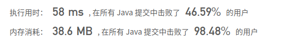
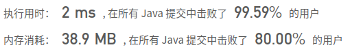

## [1. 两数之和](https://leetcode-cn.com/problems/two-sum/)

## 题目

给定一个整数数组 nums 和一个目标值 target，请你在该数组中找出和为目标值的那 两个 整数，并返回他们的数组下标。

你可以假设每种输入只会对应一个答案。但是，数组中同一个元素不能使用两遍。

 

```python
示例:

给定 nums = [2, 7, 11, 15], target = 9

因为 nums[0] + nums[1] = 2 + 7 = 9
所以返回 [0, 1]
```


链接：https://leetcode-cn.com/problems/two-sum

## 解题记录

+ 暴力解法，嵌套循环，如果两数相加为target，返回

```java
/**
 * @author: ffzs
 * @Date: 2020/10/3 上午7:04
 */
public class Solution {
    public int[] twoSum(int[] nums, int target) {
        int[] res = new int[2];
        for (int i = 0; i < nums.length; ++i) {
            for (int j = i + 1; j < nums.length; ++j) {
                if (nums[i] + nums[j] == target) {
                    res[0] = i;
                    res[1] = j;
                    return res;
                }
            }
        }
        return res;
    }
}
```



+ 通过map进行存储之前出现过的值和index
+ 通过判断target和当前值得差值map中是否存

```java
/**
 * @author: ffzs
 * @Date: 2020/10/3 上午7:09
 */
public class Solution2 {

    public int[] twoSum(int[] nums, int target) {
        Map<Integer, Integer> map = new HashMap<>();
        for (int i = 0; i < nums.length; i++) {
            int num = nums[i];
            if (map.containsKey(target-num)) {
                return new int[]{i, map.get(target-num)};
            }
            map.put(nums[i], i);
        }
        return new int[2];
    }
}
```

