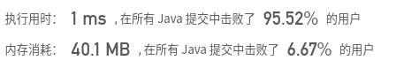

## [167. 两数之和 II - 输入有序数组](https://leetcode-cn.com/problems/two-sum-ii-input-array-is-sorted/)

## 题目

给定一个已按照升序排列 的有序数组，找到两个数使得它们相加之和等于目标数。

函数应该返回这两个下标值 index1 和 index2，其中 index1 必须小于 index2。

```java
说明:

返回的下标值（index1 和 index2）不是从零开始的。
你可以假设每个输入只对应唯一的答案，而且你不可以重复使用相同的元素。
```


```java
示例:

输入: numbers = [2, 7, 11, 15], target = 9
输出: [1,2]
解释: 2 与 7 之和等于目标数 9 。因此 index1 = 1, index2 = 2 。
```

链接：https://leetcode-cn.com/problems/two-sum-ii-input-array-is-sorted


## 解题记录

+ 双循环枚举

```java
/**
 * @author: ffzs
 * @Date: 2020/7/20 上午8:12
 */
public class Solution {
    public static int[] twoSum(int[] numbers, int target) {
        int[] res = new int[2];
        for (int i = 0; i < numbers.length; ++i) {
            for (int j = i + 1; j < numbers.length; ++j) {
                if (numbers[i] + numbers[j] == target) {
                    res[0] = i+1;
                    res[1] = j+1;
                    return res;
                }
            }
        }
        return res;
    }

    public static void main(String[] args) {
        int[] numbers = {2,7,11,15};
        int target = 9;
        System.out.println(Arrays.toString(twoSum(numbers, target)));
    }
}
```


+ 双指针
+ 因为是有序的数组
+ 通过双指针从左右递推
+ 如果和大于target，右指针向左移动
+ 如果和小于target，左指针向右移动

```java
/**
 * @author: ffzs
 * @Date: 2020/7/20 上午8:31
 */
public class Solution2 {
    public static int[] twoSum(int[] numbers, int target) {
        int l = 0, r = numbers.length-1;
        while (l < r) {
            if (numbers[l] + numbers[r] > target) r--;
            else if (numbers[l] + numbers[r] < target) l++;
            else if (numbers[l] + numbers[r] == target)
                return new int[]{l+1, r+1};
        }
        return new int[2];
    }

    public static void main(String[] args) {
        int[] numbers = {2,7,11,15};
        int target = 9;
        System.out.println(Arrays.toString(twoSum(numbers, target)));
    }
}

```

