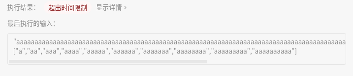

## [139. 单词拆分](https://leetcode-cn.com/problems/word-break/)

## 题目

给定一个非空字符串 s 和一个包含非空单词列表的字典 wordDict，判定 s 是否可以被空格拆分为一个或多个在字典中出现的单词。

说明：

拆分时可以重复使用字典中的单词。
你可以假设字典中没有重复的单词。

```java
示例 1：

输入: s = "leetcode", wordDict = ["leet", "code"]
输出: true
解释: 返回 true 因为 "leetcode" 可以被拆分成 "leet code"。
```

```java
示例 2：

输入: s = "applepenapple", wordDict = ["apple", "pen"]
输出: true
解释: 返回 true 因为 "applepenapple" 可以被拆分成 "apple pen apple"。
     注意你可以重复使用字典中的单词。
```

```java
示例 3：

输入: s = "catsandog", wordDict = ["cats", "dog", "sand", "and", "cat"]
输出: false
```


链接：https://leetcode-cn.com/problems/word-break

## 解题记录

+ 将wordDict存入set中进行比较
+ 通过构建不同长度的字符串进行比较


```java
/**
 * @author ffzs
 * @describe
 * @date 2020/6/25
 */
public class Solution2 {
    static int max = 0, min = Integer.MAX_VALUE;
    public static boolean wordBreak(String s, List<String> wordDict) {
        Set<String> wordSet = new HashSet<>();
        for (String s1 : wordDict) {
            wordSet.add(s1);
            max = Math.max(max, s1.length());
            min = Math.min(min, s1.length());
        }
        return wordBreak(s, 0, wordSet);
    }

    private static boolean wordBreak (String s, int start, Set<String> wordSet) {
        if (start == s.length()) return true;
        else {
            for (int i = Math.min(s.length(), start+max); i >= start + min; -- i) {
                if (wordSet.contains(s.substring(start, i)) && wordBreak(s, i, wordSet)) {
                    return true;
                }
            }
        }
        return false;
    }

    public static void main(String[] args) {
        String s = "aaaaaaa";
        List<String> wordDict = new ArrayList<>(List.of(new String[]{"aaaa", "aaa"}));
        System.out.println(wordBreak(s, wordDict));
    }
}

```



暴力解法没成，超时了。。。

## 优化

通过使用动态规划进行对状态进行记录

+ 通过一个step数组记录目标字符串可以通过字典中字符串拼接到的位置
+ 起始状态是step[0]=true
+ 转成set进行查找比list快很多

```java

/**
 * @author ffzs
 * @describe
 * @date 2020/6/25
 */
public class Solution3 {
    static int max = 0, min = Integer.MAX_VALUE;
    public static boolean wordBreak(String s, List<String> wordDict) {
        Set<String> wordSet = new HashSet<>();
        boolean[] step = new boolean[s.length()+1];
        step[0] = true;
        for (String s1 : wordDict) {
            wordSet.add(s1);
            max = Math.max(max, s1.length());
            min = Math.min(min, s1.length());
        }

        for (int i = 0; i <= s.length()-min+1; i++) {
            for (int j = i + min; j <= s.length() && j <= i + max; j++) {
                if (step[i]) {
                    if (wordSet.contains(s.substring(i, j))){
                        step[j] = true;
                    }
                }
            }
        }
        return step[s.length()];
    }

    public static void main(String[] args) {
        String s = "aaaaaaa";
        List<String> wordDict = new ArrayList<>(List.of(new String[]{"aaa", "aaaa"}));
        System.out.println(wordBreak(s, wordDict));
    }
}
```


+ 通过使用HashMap对字典中的字符串通过第一个字符进行存储
+ 更改比对的逻辑，通过第一个字符获取到对应的字符串数据
+ 动态规划的逻辑是一样的
+ 匹配到最后，能够拼成长度为s.length则返回true否者返回false

```java
/**
 * @author ffzs
 * @describe
 * @date 2020/6/25
 */
public class Solution4 {
    public static boolean wordBreak(String s, List<String> wordDict) {
        Map<Character, List<String>> map = new HashMap<>();
        char[] seq = s.toCharArray();
        for (String s1 : wordDict) {
            Character f = s1.charAt(0);
            if (!map.containsKey(f)){
                List<String> l = new ArrayList<>();
                l.add(s1);
                map.put(f, l);
            }else{
                map.get(f).add(s1);
            }
        }
        boolean[] step = new boolean[seq.length + 1];
        step[0] = true;
        for (int i = 0; i < seq.length ; i++) {
            if (step[i] && map.containsKey(seq[i])){
                for (String s1 : map.get(seq[i])) {
                    if (isMatch(seq, s1, i)) {
                        if (i+s1.length() == seq.length) return true;
                        step[i+s1.length()] = true;
                    }
                }
            }
        }
        return false;
    }

    private static boolean isMatch (char[] seq, String s, int start) {
        if (start + s.length() > seq.length) return false;

        for (int i = 0; i < s.length(); i++) {
            if (s.charAt(i) != seq[start+i]) return false;
        }

        return true;
    }

    public static void main(String[] args) {
        String s = "leetcode";
        List<String> wordDict = new ArrayList<>(List.of(new String[]{"leet", "code"}));
        System.out.println(wordBreak(s, wordDict));
    }
}
```

